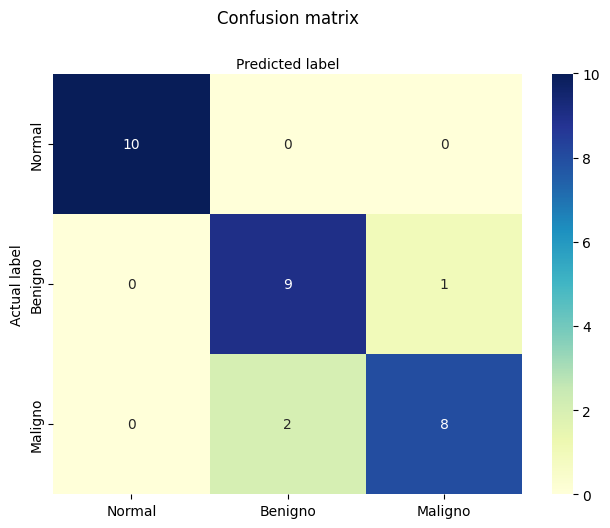
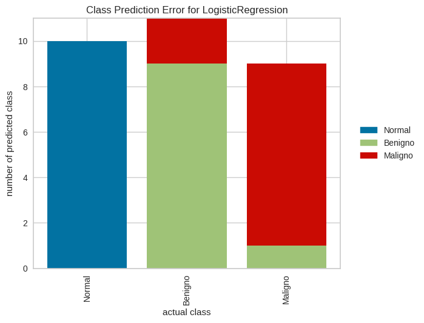
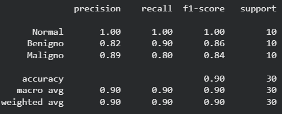
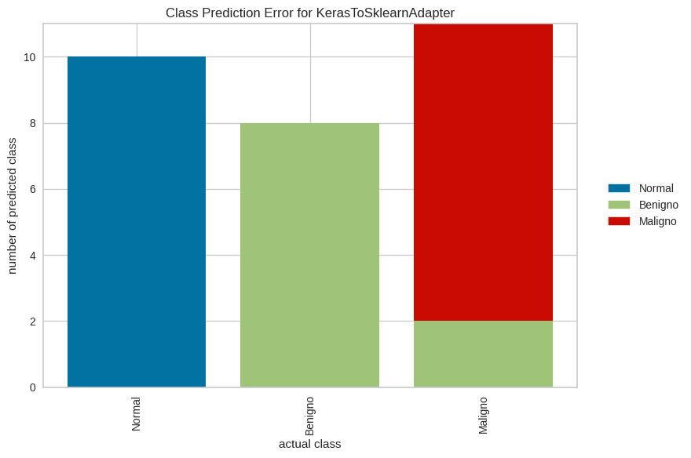
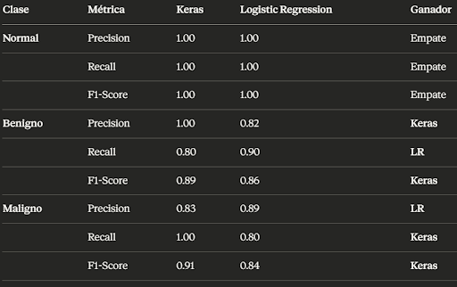

# Cell Net: Análisis con Regresión Logística
***Documentación escrita por Silvio Josep Ramón Salgado***

El modelo que he escogido es LogisticRegression de scikit.

Antes de empezar la documentación sobre su implementación, hay que aclarar qué es la **regresión logística**, y por qué me he decantado por este modelo de clasificación.

La regresión logística en Machine Learning *(sin entrar en estadística)* es un algoritmo utilizado usualmente para problemas de clasificación binaria, es decir, cuando se tiene que dar una respuesta entre “Sí” o “No”, “Perro” o “Gato”, “0” o “1”. 
Pero no todo es blanco o negro, muchas veces es gris, y la regresión logística no se salva.

Existen problemas donde una respuesta binaria no es suficiente o no nos sirve directamente.

Estos problemas son los llamados “de multiclase” o “clasificación múltiple”, donde no nos sirve decir que una imagen de un animal es “Perro” o “No Perro”, si no que tendremos que elegir si es "Perro", “Gato”, “Pájaro”, etc.
Afortunadamente, LogisticRegression de scikit permite la clasificación multiclase sin complicación alguna.

	    
	
La regresión logística binaria utiliza la función **sigmoide** que transforma valores en una probabilidad entre 0 y 1:

En cambio, la regresión logística de múltiple clasificación utiliza la función **softmax** para asignar una probabilidad (menor que 1 para que todas sumen esta cantidad) a cada respuesta y el modelo predice la clase que tenga más.

Ahora bien, ***¿cómo utilizamos este modelo para nuestro problema en Cell-Net?***
Las razón por la cual he elegido este modelo es su simplicidad a la hora de implementarlo en el código, lo cuál me hizo decantar por este antes que un árbol de decisión, por ejemplo.

**Procederé a explicar la implementación del modelo.**

Primero, vamos a importar las librerías necesarias:

    #Instalar librerias para dibujar la red gráficamente
    !pip install pydot
    !apt-get install graphviz

    #Cargar librerias necesarias
    import os
    import pandas as pd
    import random
    import numpy as np
    import matplotlib.pyplot as plt
    import seaborn as sns

    #Importamos nuestro modelo
    from sklearn.linear_model import LogisticRegression
    from sklearn.model_selection import train_test_split
    from sklearn.metrics import classification_report, accuracy_score

Luego, procederemos con los mismos pasos que el Colab original de Cell-Net para preparar el dataset:

    url_dataset = "https://raw.githubusercontent.com/Xachap/cell-network-example/main/cells.csv"
    SEED = 42

    # Cargamos el conjunto de datos (csv) a través de la URL
    dataframe = pd.read_csv(url_dataset, header = None)

    # Mostramos el conjunto de datos
    print("Estructura del dataset:\n")
    dataset = dataframe.values
    print(dataset)

    # Dividimos el conjunto de datos en variables de entrada (X) y salida (Y)
    X = dataset[:,0:4].astype(float)
    y = dataset[:,4]

    # Las clases aparecen sin codificar
    # Es necesario asignarle un número entero a cada una
    classes = {
    "Normal": 0,
    "Benigno": 1,
    "Maligno": 2
    }

Y dividimos el conjunto de datos en train, validation y test de la siguiente manera:

    #Realizamos una primera división para dividir el conjunto en "test" y "train"
    X_train, X_test, y_train, y_test = train_test_split(X, y, test_size = 0.2, stratify = y, random_state = SEED, shuffle = True)

    #Luego, una segunda división para dividir en "validation" y "train" final
    X_train, X_val, y_train, y_val = train_test_split(X_train, y_train, test_size = 0.25, stratify = y_train, random_state = SEED, shuffle = True)

    print(f"Muestras originales: {X.shape[0]}")
    print(f"Train: {X_train.shape[0]} muestras")
    print(f"Val:   {X_test.shape[0]} muestras")
    print(f"Test:  {X_test.shape[0]} muestras")

Ahora "traducimos" los nombres de las clases por su entero asignado:

    # Sustituimos los nombres de las clases por el entero asignado,
    # tanto para el conjunto de entrenamiento, validación y para el de test
    y_train = [classes[elem] for elem in y_train]
    y_val = [classes[elem] for elem in y_val]
    y_test = [classes[elem] for elem in y_test]

Y entrenamos, validamos y evaluamos finalmente el modelo:

    #Instanciamos y entrenamos el modelo
    model = LogisticRegression(multi_class='multinomial',solver="lbfgs",max_iter=200)
    model.fit(X_train, y_train)

====

    #Ajustamos hiperparámetros y conseguimos el mejor modelo
    mejor_modelo = None
    mejor_score = 0

    for C in [0.01, 0.1, 1, 10, 100]:

        modelo = LogisticRegression(C=C, max_iter=1000)
        modelo.fit(X_train, y_train)

        pred_val = modelo.predict(X_val)
        score = accuracy_score(y_val, pred_val)

        print(f"C={C} -> {score}")

        if score > mejor_score:
            mejor_score = score
            mejor_modelo = modelo

====

    #Evaluación final
    y_test_pred = mejor_modelo.predict(X_test)

    acc_test = accuracy_score(y_test, y_test_pred)
    print("Accuracy final en test:", acc_test)

Pero aún no hemos terminado. Vamos a crear dos gráficas para poder **visualizar** los resultados.

Empezamos con la matriz de confusión y utilizaremos la variable "y_test_pred" para comparar los resultados predecidos contra los actuales.

    #Creamos una matriz de confusión
    from sklearn import metrics
    cnf_matrix = metrics.confusion_matrix(y_test, y_test_pred)

    #Mostramos la matriz con un heatmap
    class_names=["Normal","Benigno","Maligno"]
    fig, ax = plt.subplots()
    tick_marks = np.arange(len(class_names))
    plt.xticks(tick_marks, class_names)
    plt.yticks(tick_marks, class_names)

    sns.heatmap(pd.DataFrame(cnf_matrix, index=class_names, columns=class_names),
                annot=True, cmap="YlGnBu" ,fmt='g')
    ax.xaxis.set_label_position("top")
    plt.tight_layout()
    plt.title('Confusion matrix', y=1.1)
    plt.ylabel('Actual label')
    plt.xlabel('Predicted label')
    plt.show()

Y si hemos seguido los pasos correctamente, obtenemos la siguiente matriz:

Antes de comentar sobre los resultados, vamos con la siguiente gráfica:

    from yellowbrick.classifier import ClassPredictionError

    visualizer = ClassPredictionError(
        mejor_modelo, classes = ["Normal","Benigno","Maligno"]
    )

    visualizer.fit(X_train, y_train)

    visualizer.score(X_test,y_test)

    visualizer.show()

***¿Qué nos dicen estas representaciones?***

Nos dicen que de las 30 muestras de test:

1.Las 10 muestras de células normales las predice **correctamente**.

2.De las 10 muestras de células benignas, el modelo predice 9 correctamente pero predice 1 como "benigno".

3.Y de las 10 muestras de células malignas, 2 son predecidas como "benigno" y las otras 8 son clasificadas correctamente.

Y, como acompañamiento, podemos mostrar las métricas de cada clase de la siguiente manera:

    target_names = ['Normal', 'Benigno', 'Maligno']
    print(classification_report(y_test, y_test_pred, target_names=target_names))

### Comparación de modelos

Con los resultados que nos ha ofrecido nuestro modelo de clasificación, toca **compararlos** con los de la red neuronal Keras.

Para empezar con este apartado, aclararé a continuación los criterios de evaluación que voy a seguir para comparar los modelos:

1. **Resultados que nos ofrecen**: Compararemos las distintas métricas para cada clase y sus gráficas. Todo ello teniendo en cuenta la validación simple, ya que ambos cuentan con ella.

2. **Dificultad de implementación**: Para este criterio, tendré en cuenta el código necesario para llegar a nuestro objetivo y su documentación disponible en Internet.

3. **Adecuación al problema**: Finalmente, valoraremos cuál es el más indicado para el problema planteado.

#### Resultados ofrecidos:

Empezaremos visualizando los gráficos de cada modelo.

Matriz de confusión:

Ambos modelos cuentan con las mismas muestras de test (30).
La primera matriz pertenece a la red neuronal de Keras. A simple vista, podemos apreciar que el modelo de red neuronal ofrece mejores resultados que el de regresión logística.
El modelo de Keras acierta en 28 casos, mientras que el Scikit en 27.

Veamoslo mejor con un gráfico de barras:

Ahora bien, ***¿esta diferencia es realmente importante, o podemos pasarla por alto?***

Lo decidiremos visualizando las métricas:

Pero antes de evaluar, debemos tener en cuenta el contexto médico de Cell-Net.
Un modelo dedicado al área de salud, debe tener cuidado con sus predicciones. Si el modelo tiene un descuido y cataloga como "Benigno" o "Normal" a una célula maligna, podríamos provocar terribles consecuencias en el paciente.

Entonces, *¿qué metrica se encarga de que esto no curra?*
El **Recall** de la clase **"Maligno"**.
Y, como podemos ver, Keras destaca en esta métrica sobre LR de Scikit. Por ende, podemos darle este punto a la red neuronal.

#### Dificultad de implementación:

En este criterio de evaluación, voy a anticipar el resultado. Este punto se lo lleva LogisticRegression. Y por palizón.

Empecemos primero por lo básico, las líneas de código.
Sin tener en cuenta el resto de librerías, y solo las esenciales, tenemos las siguientes líneas:

    #Importación de librerías: 2 líneas
    from sklearn.linear_model import LogisticRegression 
    from sklearn.metrics import classification_report, accuracy_score

    #Entrenamiento del modelo: 2 líneas
    model = LogisticRegression(multi_class='multinomial',solver="lbfgs",max_iter=200)
    model.fit(X_train, y_train)

    #Validación simple: 12 líneas
    mejor_modelo = None
    mejor_score = 0
    for C in [0.01, 0.1, 1, 10, 100]:
        modelo = LogisticRegression(C=C, max_iter=1000)
        modelo.fit(X_train, y_train)
        pred_val = modelo.predict(X_val)
        score = accuracy_score(y_val, pred_val)
        print(f"C={C} -> {score}")
        if score > mejor_score:
            mejor_score = score
            mejor_modelo = modelo

    #Evaluación final: 2 líneas
    y_test_pred = mejor_modelo.predict(X_test)
    acc_test = accuracy_score(y_test, y_test_pred)

Total: **18 líneas**.
Y porque tenemos en cuenta la validación simple. Si no, serían muchísimas menos.

Ahora, contemos las líneas con keras.

    #Importar librerías: 4 líneas
    from tensorflow import keras 
    from tensorflow.keras import layers 
    from tensorflow.keras.utils import to_categorical 
    from tensorflow.keras.callbacks import EarlyStopping, ModelCheckpoint

    #Traducir datos: 3 líneas
    train_labels = to_categorical(y_train)
    val_labels = to_categorical(y_val)
    test_labels = to_categorical(y_test)

    #Definir arquitectura: 7 líneas
    def baseline_model():
        model = Sequential()
        model.add(Dense(4, input_dim=4, activation='relu'))
        model.add(Dense(3, activation='sigmoid'))
        model.compile(loss='categorical_crossentropy', optimizer=Adam(learning_rate=0.001), metrics=['accuracy'])
        print(model.summary())
        return model

    #Crear callbacks para validación simple: 14 líneas
    model_checkpoint = ModelCheckpoint(
        filepath = 'best_model_epoch_{epoch:02d}_val_loss_{val_loss:.2f}.keras',
        monitor = 'val_loss',
        save_best_only = True,
        save_weights_only = False,
        mode = 'min',
        verbose = 1
    )
    early_stopping = EarlyStopping(
        monitor = 'val_loss',
        patience = 15,
        min_delta = 0.001,
        mode = 'min',
        restore_best_weights = True,
        verbose = 1
    )

    #Entrenar: 2-3 líneas
    network = baseline_model()
    history = network.fit(X_train, train_labels, epochs=100, validation_data=(X_val, val_labels),
                        batch_size=5, shuffle=True, callbacks = [early_stopping, model_checkpoint])

    #Evaluación del modelo: 2-3 líneas
    test_loss, test_acc = network.evaluate(X_test, test_labels)
    print('Test Accuracy: ', test_acc, '\nTest Loss: ', test_loss)
    y_pred = np.argmax(network.predict(X_test), axis=-1)

Total: sobre unas **32 líneas**. Casi el doble.

Y si las líneas no son suficientes, veamos los pasos a seguir:

-LogisticRegression:
1. Importar el modelo
2. Crear instancia del modelo
3. Entrenar
4. Evaluar con los datos de validación
5. Predecir

-Keras:
1. Importar dependencias
2. Transformar etiquetas
3. Definir arquitectura de la red
4. Compilar el modelo
5. Configurar callbacks
6. Configurar semillas para reproducibilidad
7. Entrenar el modelo
8. Evaluar durante entrenamiento
9. Transformar predicciones

Casi el doble de nuevo.

Y por último, una valoración subjetiva.
A simple vista, es más que evidente que para un principiante como es mi caso, el modelo más fácil de utilizar es Logistic Regression de scikit.

Además de que cuenta con una enorme documentación en Internet, y no solo hablo de la oficial.
Si se nos pidiese plantear una solución al problema Cell-Net, sin duda elegiría usar regresión logística antes que una red neuronal por su facilidad.

Pero, una vez evaluados estos dos puntos, ***¿cuál es el adecuado para Cell-Net?***

#### Adecuación al problema:

Como hemos comprobado con el primer criterio, Keras nos ofrece unos mejores resultados que el modelo de scikit. Aunque la diferencia es poca, también es VITAL en un contexto médico.
Pero, el segundo criterio nos ha dejado bastante claro que el modelo de regresión logística de scikit es muchísimo más fácil de implementar y bastante más beginner-friendly.
Esto supone un ahorro de tiempo y recursos, algo que no podemos pasar por alto.

Pero tenemos que evaluar qué modelo es el que encaja con un problema de este tipo. Un problema que puede suponer la vida o muerte de personas.

Y, para sorpresa de nadie, **Keras es el más adecuado**.
Como ya se ha mencionado en el primer criterio, hay que priorizar los FN antes que FP con respecto a tumores malignos. Y con priorizar, me refiero a reducir lo máximo posible los casos de este tipo.
Posiblemente, para otros problemas será más adecuado utilizar un modelo más simple que nos ahorre recursos importantes, pudiendo permitirnos unos “peores” resultados.

Pero este no ha sido el caso. Por ello, podemos concluir que:

***El modelo de redes neuronales de Keras es el indicado para el conjunto de Cell-Net***
